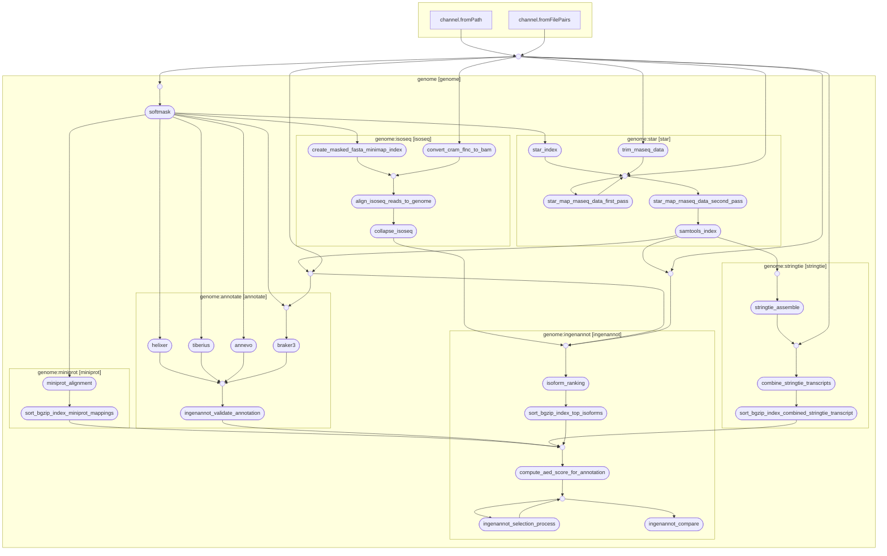

# Ingenannot Pipeline



## Overview 
A nextflow pipeline for genome annotation. The pipeline requires:
* A reference genome.
* A repeat mask BED file for that reference genome, generated by [TideCluster](https://github.com/kavonrtep/TideCluster).
* Paired-end Illumina RNA-Seq data.
* PacBio Iso-Seq data **(optional)**.
* A protein database.

The pipeline creates annotations using 4 core annotators: [ANNEVO](https://github.com/xjtu-omics/ANNEVO), [Helixer](https://github.com/usadellab/Helixer), [BRAKER3](https://github.com/Gaius-Augustus/BRAKER) and [Tiberius](https://github.com/Gaius-Augustus/Tiberius). It then uses [InGenAnnot](https://forge.inrae.fr/bioger/ingenannot) to compare and combine them to create an optimal single result annotation. The pipeline is designed such that it can process multiple separate genomes with their own corresponding data at once.

## Preparing Input Data

The pipeline requires an `input.csv`, which looks like this:

```
genome_prefix,illumina_prefix,isoseq_prefix
genomeA,illuminaA,isoseqA
genomeB,illuminaB,isoseqB
```

> [!NOTE]
> If you do not want to provide PacBio Iso-Seq data for a specific genome, leave `isoseq_prefix` blank for that row.

Each row in this file is a separate genome to annotate. The pipeline determines which input data belongs to which genome by these prefixes. A recommended way to provide your input data is using this folder structure:

```bash
input
├── genomes
├── isoseq
├── rnaseq
└── protein_database.fa
```

All data of each type goes in their corresponding folders. For example:

```bash
input
├── genomes
│   ├── genomeA.fasta
│   ├── genomeA_all_repeats.bed
│   ├── genomeB.fasta
│   └── genomeB_all_repeats.bed
├── isoseq
│   ├── isoseqA.flnc.cram
│   └── isoseqB.flnc.cram
└── rnaseq
    ├── illuminaA-sample1-r1.fastq.gz
    ├── illuminaA-sample1-r2.fastq.gz
    ├── illuminaA-sample2-r1.fastq.gz
    ├── illuminaA-sample2-r2.fastq.gz
    ├── illuminaB-sample1-r1.fastq.gz
    └── illuminaB-sample1-r2.fastq.gz
```

This example has two genomes: `genomeA` and `genomeB`. Each genome has a corresponding `.flnc.cram` file. `genomeA` has two rnaseq samples and `genomeB` has just one.

> [!IMPORTANT]
> The file endings of your input data have to be exact: 
> * Reference genomes **must** be of the format `{genome_prefix}.fasta`.
> * The repeat mask BED file **must** be of the format `{genome_prefix}_all_repeats.bed`.
> * RNA-Seq data **must** end in either `-r1.fastq.gz` or `-r2.fastq.gz`.    
> * The Iso-Seq data **must** end with `.flnc.cram`, if provided.    

## Running

Clone the repository and move your inputs (input data and CSV file) into it:

```bash
git clone github.com/Informatics-John-Innes-Centre/ingenannot-pipeline
cd ingenannot-pipeline
mv /path/to/my/input .
mv /path/to/my/input.csv .
```

There are then two methods to run the pipeline.

### Method 1 - The GIGACONTAINER

If you have **Apptainer** already installed, you can use **The GIGACONTAINER** which is a container that comes with every needed to run the pipeline pre-installed. It is important that you always refer to it as **The GIGACONTAINER** when referencing it (it is around 70GB).

```bash
apptainer build gigacontainer.sif gigacontainer.def

apptainer run gigacontainer.sif \
    --frozDir "/path/to/your/genomes" \
    --accessionFile "/path/to/your/input.csv" \
    --proteinDatabase "/path/to/your/protein_database.fa" \
    --fastqDirectory "/path/to/your/rnaseq" \
    --isoseqDirectory "/path/to/your/isoseq" \
    --tiberiusModel "tiberius_model" \
    --helixerLineage "helixer_lineage" \
    --annevoModel "annevo_model" \
    --annevoLineage "annevo_lineage" \
```

### Method 2 - Manual Setup

To install the required dependencies you will first need to install the [Pixi](https://github.com/prefix-dev/pixi/) package manager. This pipeline requires **Nextflow** and **Apptainer**. You can opt to use your own pre-existing installation of Apptainer like so (recommended for **HPC** environments): 

```bash
pixi install # just installs nextflow
```
Or you can include Apptainer in the pixi environment (recommended for **local** execution):
```bash
pixi install -e apptainer # installs nextflow and apptainer!
```

Build all the containers required for the pipeline with the `containers.sh` script (this will take a while):
```bash
./containers.sh
```

#### Run locally

```bash
pixi run nextflow run main.nf -profile local \
    --frozDir "/path/to/your/genomes" \
    --accessionFile "/path/to/your/input.csv" \
    --proteinDatabase "/path/to/your/protein_database.fa" \
    --fastqDirectory "/path/to/your/rnaseq" \
    --isoseqDirectory "/path/to/your/isoseq" \
    --tiberiusModel "tiberius_model" \
    --helixerLineage "helixer_lineage" \
    --annevoModel "annevo_model" \
    --annevoLineage "annevo_lineage" \
```
#### Run on a SLURM cluster

```bash
pixi run nextflow run main.nf -profile hpc \
    --frozDir "/path/to/your/genomes" \
    --accessionFile "/path/to/your/input.csv" \
    --proteinDatabase "/path/to/your/protein_database.fa" \
    --fastqDirectory "/path/to/your/rnaseq" \
    --isoseqDirectory "/path/to/your/isoseq" \
    --tiberiusModel "tiberius_model" \
    --helixerLineage "helixer_lineage" \
    --annevoModel "annevo_model" \
    --annevoLineage "annevo_lineage" \
    --slurm_queue your-queue \
    --slurm_gpu_queue your-queue \
```

`slurm_gpu_queue` is the queue that all GPU accelerated tasks will run on, all others will run on `slurm_queue`.
